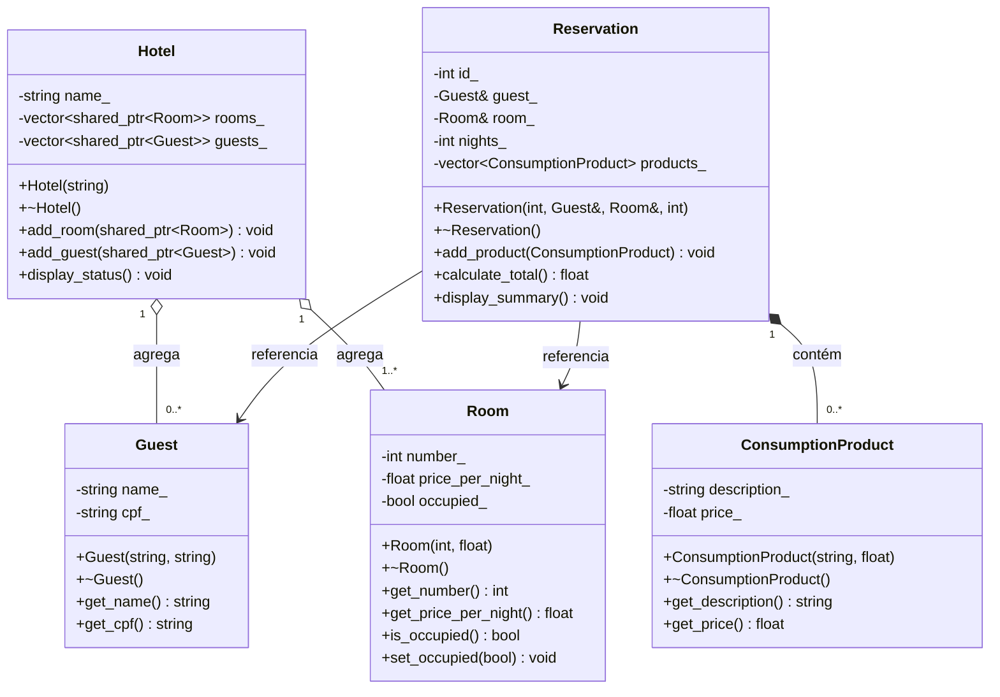

# Sistema de Hotel

**Nome:** Davidys Cavalcante de Pontes  
**Matrícula:** 20250019035

## Descrição

Este projeto se resume a um sistema de gerenciamento de hotel. O hotel possui quartos que podem ser reservados por hóspedes, cada reserva pertence a um hóspede e a um quarto específico, e pode conter itens de consumo, como serviços adicionais. O sistema permite realizar reservas e calcular o valor total a pagar.

## Diagrama UML



## Smart Pointers

- `shared_ptr<Room>` no Hotel: quarto é agregado — pode ser compartilhado e existe independentemente do hotel.
- `shared_ptr<Guest>` no Hotel: hóspede é agregado — pode ser compartilhado e existe independentemente do hotel.
- `Guest&` e `Room&` na Reservation: a reserva apenas referencia o hóspede e o quarto, sem posse — referência é suficiente.
- `vector<ConsumptionProduct>` na Reservation: composição por valor — os produtos pertencem à reserva e são destruídos com ela, sem necessidade de ponteiro.

## Como Compilar e Executar

```bash
cmake -B build
cmake --build build
./build/hotel_system
```
