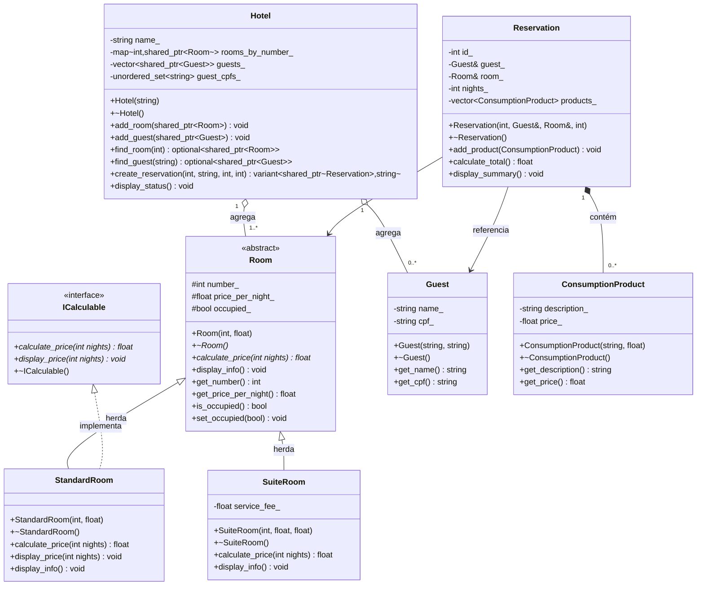
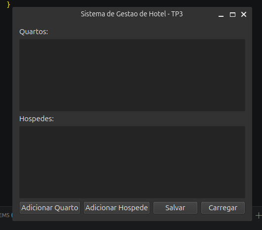

# Sistema de Hotel

**Nome:** Davidys Cavalcante de Pontes  
**Matrícula:** 20250019035

## Descrição

Este projeto se resume a um sistema de gerenciamento de hotel. O hotel possui quartos que podem ser reservados por hóspedes, cada reserva pertence a um hóspede e a um quarto específico, e pode conter itens de consumo, como serviços adicionais. O sistema permite realizar reservas e calcular o valor total a pagar.

## Diagrama UML


## Herança Avançada

A classe `SuiteRoom` foi marcada como `final` (`class SuiteRoom final : public Room`) para garantir a integridade do design, impedindo que outras classes especializem o comportamento de uma Suite, conforme exigido pelo roteiro do trabalho. Além disso, o método `calculate_price` em `SuiteRoom` também utiliza o qualificador `final`, bloqueando a sobrescrita da lógica de cálculo da taxa de serviço em classes derivadas futuras, garantindo o comportamento esperado e seguro das regras de negócio do sistema.

## Smart Pointers

- `shared_ptr<Room>` no Hotel: quarto é agregado — pode ser compartilhado e existe independentemente do hotel.
- `shared_ptr<Guest>` no Hotel: hóspede é agregado — pode ser compartilhado e existe independentemente do hotel.
- `Guest&` e `Room&` na Reservation: a reserva apenas referencia o hóspede e o quarto, sem posse — referência é suficiente.
- `vector<ConsumptionProduct>` na Reservation: composição por valor — os produtos pertencem à reserva e são destruídos com ela, sem necessidade de ponteiro.

## Como Compilar e Executar

```bash
cmake -B build
cmake --build build
./build/hotel_system
```
## Como Rodar os Testes (Catch2)

```bash
cd build && ctest --output-on-failure
```

---

# TP3 — Unidade III

## Programação Genérica

- **`Registry<T>`** (`src/registry.hpp`): template de classe reutilizável que abstrai um cadastro tipado genérico (add/at/size/remove_if). É instanciado com `ConsumptionProduct` (catálogo de produtos) e `std::string` (lista de amenidades) no `main.cpp` — não é um simples apelido de `std::vector`, pois expõe uma API própria de domínio.
- **CRTP (`Counted<Derived>`, `src/counted.hpp`)**: aplicado a `Room` e `Guest` para contar instâncias vivas (`Room::alive()`, `Guest::alive()`). Usamos CRTP em vez de uma classe base virtual porque a contagem de instâncias é um comportamento **estático e por tipo** — cada `Counted<Derived>` gera um contador independente em tempo de compilação, sem a necessidade de uma vtable (que só se justifica quando há despacho em tempo de execução, como acontece com `calculate_price` em `Room`).
- **Concept `Calculable`** (`src/concepts.hpp`): restringe `total_price<T>` a tipos que possuem `calculate_price(int) -> float`. Tentar chamar `total_price` com um tipo que não satisfaz o concept (ex: `std::string`) produz um erro de compilação claro citando `constraints not satisfied`, em vez de um erro obscuro de instanciação em algum ponto interno do template.
- **Pipeline de ranges** (`Hotel::available_room_numbers()`): antes, listar números de quartos disponíveis exigiria um laço manual com um `vector` auxiliar e um `if` dentro do laço. Com `views::filter | views::transform` encadeados, a intenção (filtrar depois transformar) fica explícita na composição e a coleção é percorrida de forma preguiçosa (lazy), sem alocar uma coleção intermediária para o resultado do filtro.

## SOLID

| Princípio | Onde aparece |
|---|---|
| **SRP** | `HotelService` cuida apenas de orquestrar save/load; os repositórios cuidam apenas de persistência; `Hotel` cuida apenas das regras de domínio. **Refatoração**: antes da Q4, seria natural o próprio `Hotel` acumular a responsabilidade de se salvar/carregar — a extração de `HotelRepository`/`HotelService` foi a refatoração SRP que separou essa responsabilidade. |
| **OCP** | `Room` é o ponto de extensão: novos tipos de quarto podem ser adicionados implementando `calculate_price`/`display_info`, sem alterar `Hotel`, `Reservation` ou o código de serialização. |
| **LSP** | Qualquer `Room` derivado (`StandardRoom`, `SuiteRoom`) pode substituir a base em `Hotel`/`Reservation` sem quebrar o comportamento esperado. |
| **ISP** | `ICalculable` é uma interface pequena e focada (só `calculate_price`/`display_price`) — uma classe não é forçada a implementar métodos que não usa. |
| **DIP** | `HotelService` (alto nível) depende da abstração `HotelRepository`, recebida por injeção no construtor — nunca de `JsonHotelRepository` ou `MemoryHotelRepository` diretamente. |

## Tratamento de Erros e Concorrência

- Hierarquia `HotelError` (`src/hotel_exceptions.hpp`) separa erros de **validação/uso incorreto** (`InvalidReservationError`, `GuestNotFoundError` — lançados como exceção) de **resultados de negócio esperados** (quarto ocupado — modelado como `std::variant<shared_ptr<Reservation>, std::string>` em `Hotel::create_reservation`).
- `std::optional` em `Hotel::find_room`/`find_guest` evita ponteiro nulo em buscas que podem falhar.
- `Hotel::calculate_total_revenue_parallel` paraleliza o cálculo de preço por quarto com `std::async` (independente por quarto) e protege a soma compartilhada com `std::mutex`/`std::lock_guard`.

## Qt (GUI)

A GUI (`src/gui/`) é uma camada fina sobre a lógica já existente: `MainWindow` não contém nenhuma regra de negócio, apenas chama `Hotel::add_room`/`add_guest` e `HotelService::save_state`/`load_state`.

### Build

```bash
cmake -B build -DCMAKE_BUILD_TYPE=Debug   # detecta Qt6 automaticamente, se instalado
cmake --build build --target hotel_gui
./build/hotel_gui
```

### Screenshot

